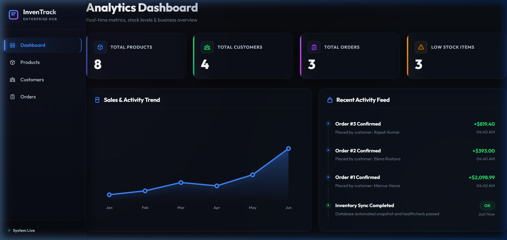
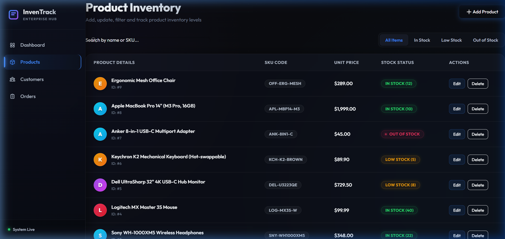
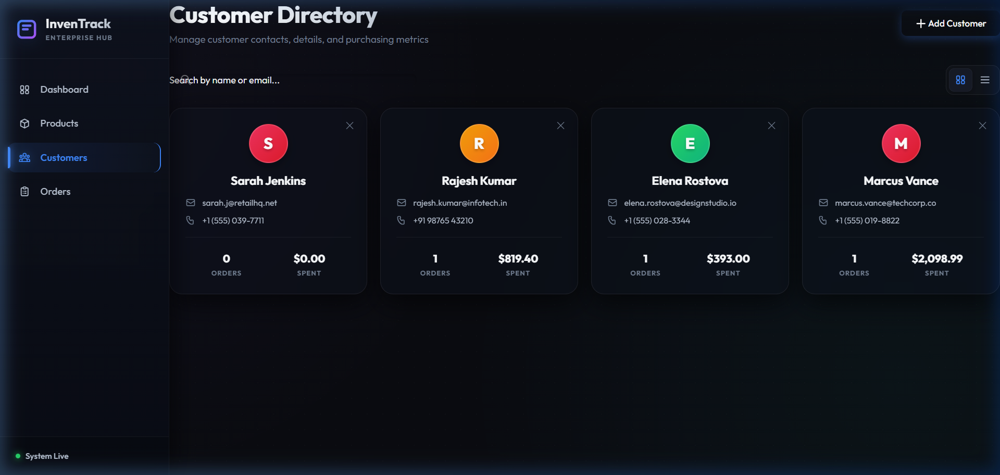
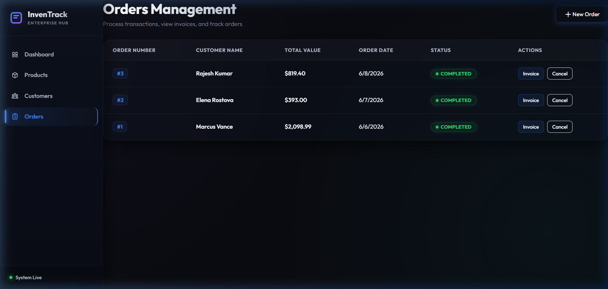
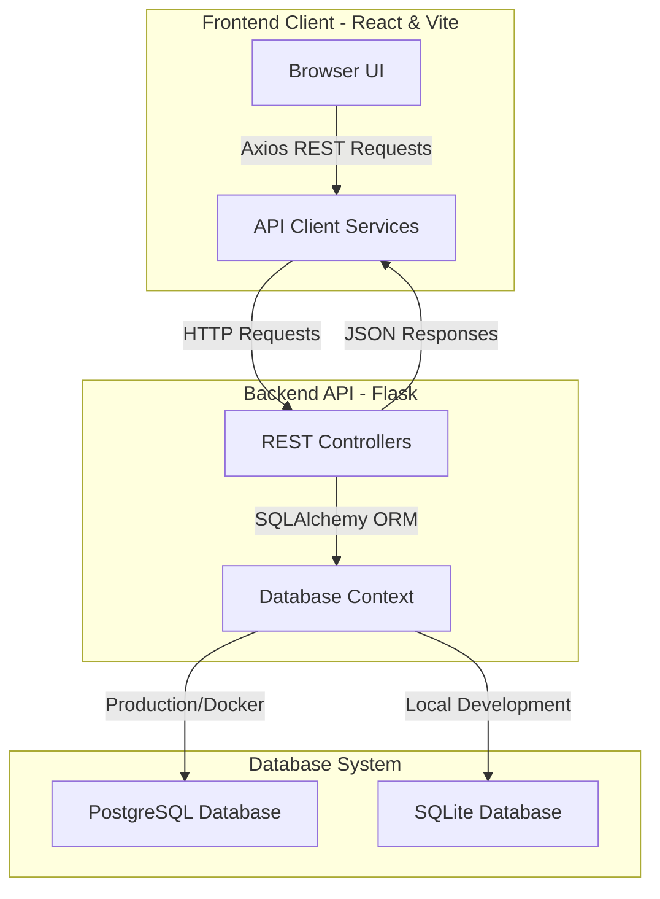
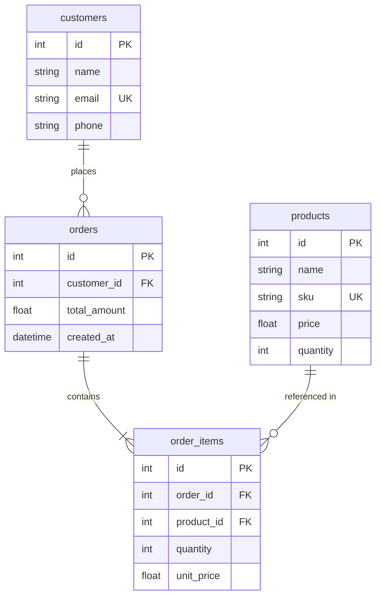
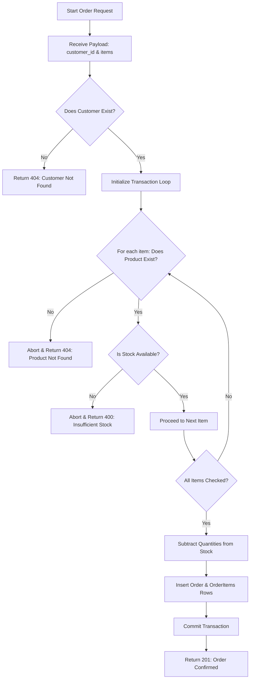
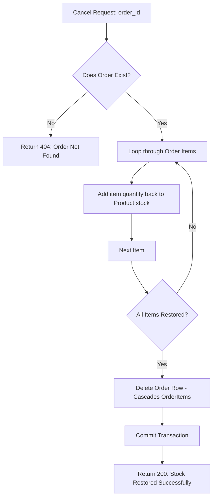

# InvenTrack — Inventory & Order Management System

**🔗 Deployed Live Demo:** [inven-track-nu.vercel.app](https://inven-track-nu.vercel.app)

A full-stack, enterprise-grade inventory and order management system. Built with a modern, glassmorphic dark user interface, real-time metrics visual charting, and transaction logic.

---

## 🎨 Visual Showcase

### 📊 Real-time Dashboard


### 📦 Products Inventory Management


### 👥 Customers Directory


### 🛒 Point of Sale & Orders


---

## 🚀 Key Features

* **Real-time Analytics Dashboard**: Features custom interactive SVG trend charts with hover tooltips and a chronological system activity timeline.
* **Automatic Database Seeding**: Pre-populates the system with realistic business items (Dell monitors, iPhones, keyboards) and completed sales orders on startup.
* **Point of Sale (POS) Checkout**: A split-screen checkout flow displaying a live-updating paper invoice receipt with taxes, subtotals, and stock validations.
* **Full CRUD Management**: Search, filter, add, and delete controls for products, customers, and transactions.
* **Responsive Sidebar Navigation**: Glassmorphic layout with custom SVG icons.

---

## 🏛️ System Architecture

InvenTrack uses a decoupled client-server architecture:



---

## 📊 Database Relational Schema

The database model is structured with standard foreign key relations and cascade-deletes for clean data consistency:



---

## 🔄 Core Business Workflows

### 1. POS Order Placement Flow
This flowchart details how the system validates customer accounts, checks stock thresholds, and commits atomic inventory deductions:



### 2. Order Cancellation Flow
Cancelling an order automatically restores inventory levels in a database transaction:



---

## 💻 Local Development Setup (Quick Start)

The application features a local SQLite fallback, allowing you to run it without setting up a database server.

### 1. Run the Backend API
1. Navigate to the `backend` directory:
   ```bash
   cd backend
   ```
2. Create and activate a Python virtual environment:
   ```bash
   python -m venv venv
   # On Windows:
   .\venv\Scripts\activate
   # On macOS/Linux:
   source venv/bin/activate
   ```
3. Install the required dependencies:
   ```bash
   pip install -r requirements.txt
   ```
4. Start the Flask server:
   ```bash
   python run.py
   ```
   *The backend will boot on `http://localhost:5000` and automatically create the SQLite database populated with seed data.*

### 2. Run the Frontend UI
1. Open a new terminal and navigate to the `frontend` directory:
   ```bash
   cd frontend
   ```
2. Install npm packages:
   ```bash
   npm install
   ```
3. Launch the Vite development server:
   ```bash
   npm run dev
   ```
   *The frontend will open at `http://localhost:5173/`.*

---

## 🐳 Docker Compose Launch

You can run the full environment (PostgreSQL database, Flask backend, and Nginx-served React frontend) in containers:

1. Create a `.env` file from the example:
   ```bash
   cp .env.example .env
   ```
2. Build and launch the services:
   ```bash
   docker-compose up --build
   ```
3. Access the services:
   * **Frontend UI**: `http://localhost:3000`
   * **Backend API**: `http://localhost:5000`

---

## ☁️ Beginner-Friendly Cloud Deployment Guide

Follow these steps to deploy InvenTrack to the cloud for free using Render and Vercel.

### Step 1: Deploy the Database on Render
1. Go to [Render](https://render.com) and sign up/log in (you can use your GitHub account).
2. Click the blue **New +** button and select **PostgreSQL**.
3. Configure the database:
   * **Name**: `inventrack-db`
   * **Instance Type**: Select **Free**.
4. Scroll down and click **Create Database**.
5. Once the database status changes to **Active**, scroll to the **Connection** section and copy the **Internal Database URL** (e.g., `postgres://...`). *Save this URL.*

### Step 2: Deploy the Backend API on Render
1. Click **New +** on Render and select **Web Service**.
2. Connect your GitHub repository containing the InvenTrack code.
3. Configure the service:
   * **Name**: `inventrack-api`
   * **Root Directory**: `backend`
   * **Language**: `Python`
   * **Build Command**: `pip install -r requirements.txt`
   * **Start Command**: `gunicorn run:app --bind 0.0.0.0:$PORT`
   * **Instance Type**: Select **Free**.
4. Scroll down, click **Advanced**, and add the following **Environment Variables**:
   * **DATABASE_URL**: *Paste the Internal Database URL copied in Step 1*
   * **SECRET_KEY**: *Type any secure random password*
5. Click **Create Web Service**. Once the deploy finishes and says **Live**, copy your API URL at the top left (e.g., `https://inventrack-api.onrender.com`).

### Step 3: Deploy the Frontend UI on Vercel
1. Go to [Vercel](https://vercel.com) and log in with your GitHub account.
2. Click **Add New** and select **Project**.
3. Import your `InvenTrack` repository.
4. Configure the project:
   * **Root Directory**: Select the `frontend` folder.
   * **Framework Preset**: Vercel will automatically detect `Vite`.
5. Expand the **Environment Variables** section and add:
   * **Key**: `VITE_API_URL`
   * **Value**: *Paste the live Render API URL from Step 2 (make sure there is no trailing slash)*
6. Click **Deploy**. Vercel will build your static files and host them live.

---

## 🔌 API Endpoints Reference

### Products CRUD
| Method | Endpoint | Description | Payload Format |
|---|---|---|---|
| `GET` | `/products` | Retrieve all products | None |
| `GET` | `/products/:id` | Get details for single product | None |
| `POST` | `/products` | Create a new product | `{"name": "...", "sku": "...", "price": 10.0, "quantity": 5}` |
| `PUT` | `/products/:id` | Update an existing product | `{"name": "...", "price": 12.0}` |
| `DELETE` | `/products/:id` | Remove product (fails if in order) | None |

### Customers CRUD
| Method | Endpoint | Description | Payload Format |
|---|---|---|---|
| `GET` | `/customers` | Retrieve customer database | None |
| `GET` | `/customers/:id` | Get details for single customer | None |
| `POST` | `/customers` | Register a new customer | `{"name": "...", "email": "...", "phone": "..."}` |
| `DELETE` | `/customers/:id` | Delete customer (fails if has orders) | None |

### Orders & Transactions
| Method | Endpoint | Description | Payload Format |
|---|---|---|---|
| `GET` | `/orders` | Retrieve order list with customer names | None |
| `GET` | `/orders/:id` | Get details and item list for single order | None |
| `POST` | `/orders` | Place a new order (modifies stock) | `{"customer_id": 1, "items": [{"product_id": 1, "quantity": 2}]}` |
| `DELETE` | `/orders/:id` | Cancel order and restore stock | None |
